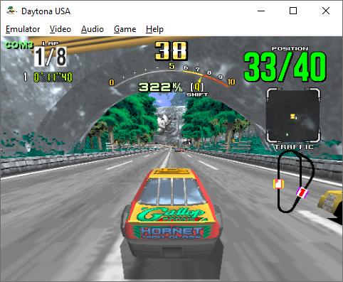
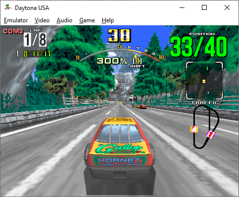

# Ches Pur Ofi

### What is this
This project is the **firmware** and **PCB design** for the hardware interface between the [Sega Model 2](https://emulation.gametechwiki.com/index.php/Sega_Model_2) emulator and **a custom homemade cockpit** which has two **pedals**, a steering **wheel**, an H **shifter** and an analog **speedometer**. The idea is to play [Daytona USA](https://en.wikipedia.org/wiki/Daytona_USA) on the emulator while using the cockpit controls and to keep the speedometer pointer in sync with the game car speed. An [Arduino Leonardo](https://docs.arduino.cc/hardware/leonardo) board makes this interface possible, reading the input values and sending them to the PC as PC Joysick buttons and axes. Also, the board controls the servo that drives the speedometer pointer and processes the car speed value given by the emulator. Additionally, a custom PCB design simplifies the setup process, allowing the user to just plug the Leonardo into the PCB and play, without additional wiring.  

The repo has the following project components:
- A **LUA script** that runs in the emulator and broadcasts the car speed value to the **Leonardo**
- A **C++ sketch** that is the firmware running inside the Leonardo, which processes the controls inputs and the speedometer motor output
- A **custom PCB** that has some pins to simplify the electrical connections between the **Leonardo** and the cockpit controls

### How to use it
While in the cockpit, plug the Leonardo pins to the board and the USB to the PC. Run the emulator from the `Daytona USA.bat` script, and specify the Leonardo COM port number when asked to. After that, the game shuld start with all the controls operational. Axes calibration process is explained in the `firmware` readme file, and is sometimes needed after a hardware change (i.e. after replacing potentiometers). In the top left corner an informative text shows the port connection status, and it's behavior is also explained in the `firmware` readme.

### Screenshots
#### Gameplay with a successful connection to the *Leonardo* (the top-left corner indicator is displaying the COM port name in green):
  

#### Gameplay with the connection to the *Leonardo* lost (the top-left corner indicator is displaying the COM port name in red):
  

#### PCB layout:
  

#### PCB 3D model:
  
